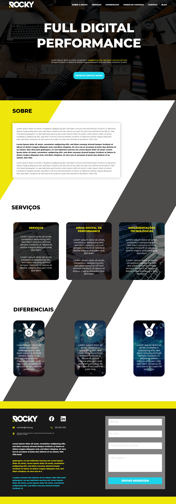

<h1 align="center">

</h1>


<h2 align="center"> 📎 Acesse o projeto online em: 
<a href="https://gustabriel.github.io/rocky/">https://gustabriel.github.io/rocky/</a> </h2>

<details close align="center">
  <summary> 
     Preview do site no modo desktop 💻
  </summary>
   <h1 style="margin: auto">
   
   </h1>
</details>

<details close align="center">
  <summary> 
     Preview do site no modo mobile 📱
  </summary>
   <h1 style="margin: auto">
   
   </h1>
</details>
<br />


# 📝 Sobre:
## O projeto do site **Rocky** é um processo seletivo da **empresa** Rocky, uma landing page do site da empresa, baseado nos mackoups disponibilizados.
<br />

# 💾 Tecnologias utilizadas:
### O Projeto foi desenvolvido utilizando as seguintes tecnologias:

- CSS;
- HTML;
- JavaScript;
<br />

# 📥 Como baixar o projeto:

``` bash
# 1 - Criar um pasta nova:
# 2 - Abrir o gitBash dentro dessa pasta:

# Clonar o repositório:
$ git clone https://github.com/Gustabriel/rocky.git

# Entrar no diretório:
$ cd rocky
```
<br />

# 🥇 Aprendizagem durante o projeto:
### - O que mais tive dificuldade durante o desenvolvimento desse projeto foi na parte de alinhamento e responsividade do site, foi dificil tentar deixar o site totalmente responsivo conforme sua largura fosse diminuindo. <br />
### - Porém, essas dificuldades contribuiram muito na minha evolução dentro do CSS e consegui aprender bastante sobre responsividade. <br />
### - Ainda pretendo aprimorar o site e adicionar mais funcionalidades e deixar ele mais dinâmico. <br />
---
<br />


<h3 align="center"> 📌 Desenvolvido por: <a href="https://www.linkedin.com/in/gabriel-gustavo31/">Gabriel Gustavo</a>;
</h3>
<h1 align="center"></h1>

<br />

<h4 align="center"> ⌛⏳ "Projeto ainda em evolução" ⌛⏳ </h4>


